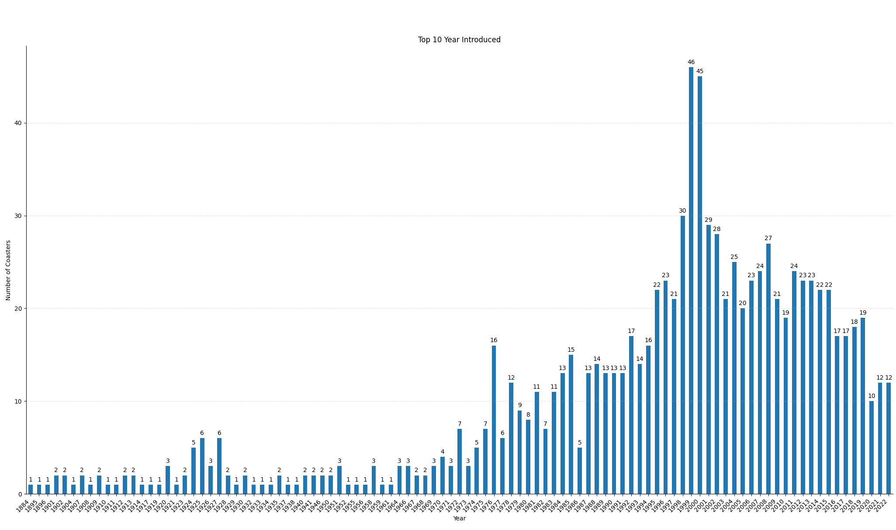
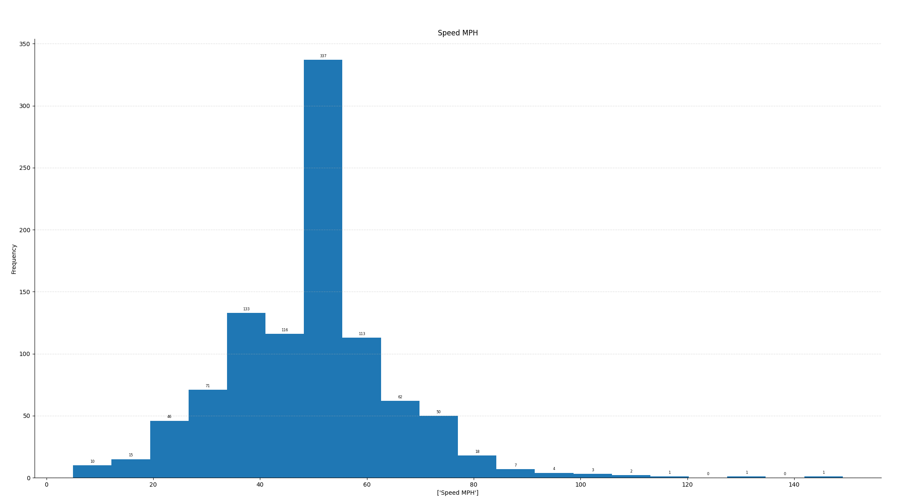
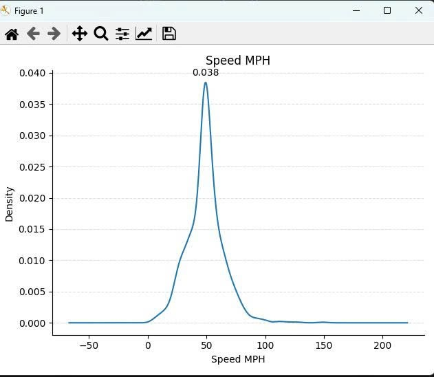
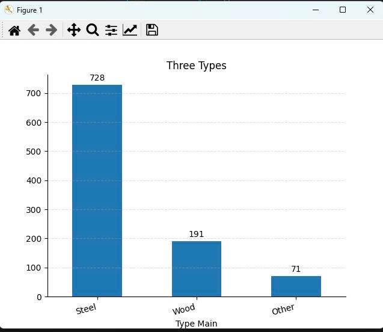
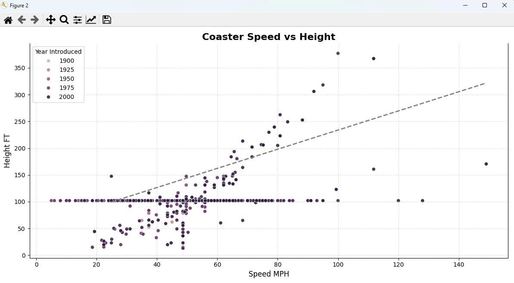
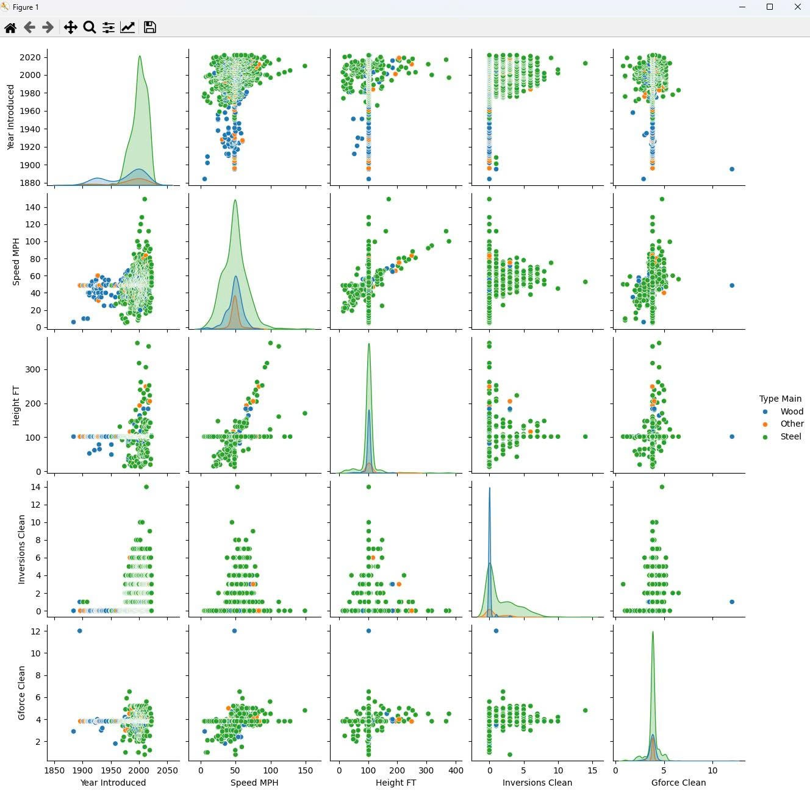
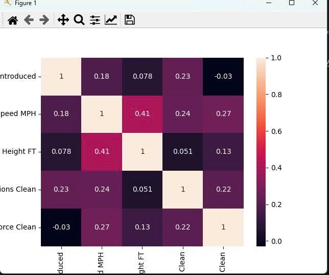
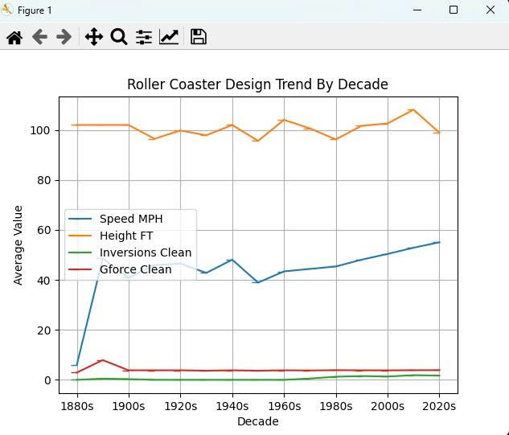
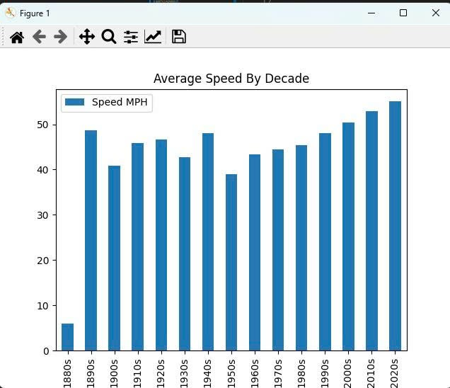

# Roller Coaster Data Analysis — Python EDA Project  

*Exploring the evolution of roller coaster designs using Python*

---

## 1. Project Overview  

This project analyzes how roller coaster design has evolved from the late 1800s to the early 2000s using Python-based exploratory data analysis (EDA).

High-level patterns:

- The **late 1990s–early 2000s** were a **construction boom**, with 1999–2000 being the peak years for new coaster introductions.
- Most coasters operate in a **mid-range speed band (~30–70 mph)**, strongly concentrated around **45–55 mph**.
- **Steel** is the **dominant construction material**, followed by wood; other types are niche.
- Over time, coasters have become **faster and more complex** (more inversions) while **height and G-force stay within a relatively narrow band**.

The goal is to turn these patterns into **business-oriented insights** for park planning, investment, and portfolio strategy.

---

## 2. Tools & Dataset  

```python
pandas, matplotlib, seaborn
```

📁 Dataset [Download](https://www.kaggle.com/datasets/robikscube/rollercoaster-database)

## 3. Key Insights & Business Implications  

**1. Year Introduced – Construction Boom Around 2000**



**Key findings**

- From 1995–2014, new coaster introductions increased significantly.
- 1999 & 2000 are peak years with 45–46 new coasters each.
- Many coasters currently operating were built ~20–25 years ago.  

**Business impact**

- A large share of the portfolio is now ageing “millennium” hardware:
    - Rising maintenance, spare parts, and inspection costs
    - Higher risk of downtime and guest complaints
    - Potential safety & reputational risk if incidents occur
- Competitors that refurbish or replace these rides earlier will gain an edge in reliability and guest perception.

**Recommendations**

- Millennium coaster health checklist
    - Focus on coasters opened 1998–2002.
    - For each ride: track age, downtime, maintenance cost, popularity, guest ratings.
- 5–10 year lifecycle plan
    - Keep & refurbish: popular and mechanically healthy → update trains, theming, queues.
    - Major renovation: strategic rides needing track/brake/structure work.
    - Replace: weak performers with low differentiation → plan new concepts.
- Leverage anniversaries
    - Use “20 years of thrills” campaigns, limited merchandise, and “upgraded edition” stories when refurbishing strong legacy coasters.

**2. Speed Distribution – Industry “Sweet Spot”**





**Key findings**

- Speed distribution is **right-skewed** with a strong peak around **45–55 mph**.
- Most coasters sit in a **mid-range band 30–70 mph**.
- **Low-speed (< 20 mph)** and **extreme (> 80 mph)** coasters are both relatively rare.
- A **single dominant mode ~50 mph** reflects the industry’s “standard” thrill level.

**Business impact**

- **Design sweet spot**
- 45–55 mph balances thrill, comfort, safety, and cost.
- **Portfolio crowding**
- A lineup of only 40–60 mph rides lacks:
    - Very gentle **family rides**
    - A true **headline extreme coaster**
- **Cost vs differentiation**
- Extreme coasters (> 80 mph) are **rare, iconic, costly**, but build brand power.
- Mid-speed rides must elevate **capacity, theming, and reliability** to stand out.

**Recommendations**

- **Define speed segments**
- Family: < 25 mph  
- Moderate: 25–45 mph  
- Thrill: 45–65 mph  
- Extreme: > 65 mph  
- Count rides per segment per park to **check balance**.

- **Identify strategic gaps**
- Too few family rides → invest in **low-speed, highly themed attractions**.
- No ride above ~70 mph → add a **flagship high-speed coaster**.

- **Use speed + behavior data**
- Combine with:
    - Queue times / throughput  
    - Guest satisfaction  
    - Maintenance & operating costs  
- Check if **extreme speed** truly pays off vs **mid-speed, well-themed** rides with stronger ROI.

- **Speed-based marketing**
- Mid-range rides → emphasize **smoothness, airtime, theming**.
- Very fast rides → highlight speed (**“one of the fastest in the region”**).

**3. Material Mix – Steel Dominates, Wood Differentiates**



**Key findings**

- The dataset is heavily dominated by **steel coasters**:  
- Steel: 728  
- Wood: 191  
- Other: 71  
- Steel ≈ **75%** of entries → **industry standard**.
- Wooden coasters remain **significant**, while “Other” types are **niche**.

**Business impact**

- **Steel as default**
- Supports higher speeds/heights, complex layouts, inversions, and modern launch systems.

- **Wood as a strategic differentiator**
- Offers a **classic / nostalgic** ride feel.
- Can position a park with **heritage** or **old-school thrill** branding.

- **Niche technologies (“Other”)**
- Great for novelty and variety, but **rarely portfolio anchors**.

**Recommendations**

- **Compare park mix vs industry mix**
- Nearly 100% steel → add **one iconic wooden coaster** for variety and brand depth.
- Many wooden coasters but few steel headliners → invest in a **steel flagship**.

- **Position by material**
- Steel: **high-tech, intense, cutting-edge**
- Wood: **airtime, rattle/feel, nostalgia**

- **Plan CAPEX by material**
- Steel: **higher cost**, greater flexibility for future upgrades/inversions.
- Wood: lower stats but **strong theming & storytelling** value.

- **Explore hybrid concepts**
- Steel track + wood support (e.g., **RMC-style hybrids**) to combine:
    - **Wooden aesthetic**
    - **Steel smoothness** and element diversity

**4. Design Relationships – Speed, Height, Inversions, G-force**







3.4 Design Relationships – Speed, Height, Inversions, G-force

**Key findings**

- **Speed vs Height**
- Moderate positive correlation (~0.41) → taller coasters tend to be faster, but not perfectly.
- Main cluster: **40–70 mph** and **80–160 ft** → standard thrill zone.

- **Speed / Height vs Inversions & G-force**
- Faster coasters generally have **more inversions** and **higher G-forces**, but correlations are only mild to moderate.
- Height alone is a **weak predictor** of intensity → **layout and elements** matter more.

- **Inversions vs G-force**
- Positive but modest correlation (~0.22) → more inversions **≠** automatically extreme G-force.

- **Year Introduced vs features**
- Newer coasters → slightly **faster** and **more inversions**.
- **Height and G-force remain stable** → designers keep forces within comfort/safety limits (~3–4 G).

- **By material**
- **Steel**: dominates high speed, height, inversions, G-force → **extreme thrill platform**.
- **Wood**: moderate speed, low-inversion → **family / classic airtime** profiles.

**Business impact**

- **Design levers**
- Speed + layout drive thrills more than pure height → safer, cheaper ways to increase intensity.

- **Modernization signal**
- Older, low-speed, low-inversion coasters risk feeling **dated** compared to modern line-ups.

- **Comfort and safety**
- Weak correlations with G-force → forces are **actively controlled** to meet comfort/regulatory standards.

**Recommendations**

- **Segment by intensity**
- Use **Speed + Height + Inversions + G-force** to classify:
    - Family / moderate  
    - Core thrill  
    - Extreme thrill  
- Check park **balance** across intensities and materials.

- **Upgrade levers**
- Prioritize:
    - **Speed tuning** (launches, steeper drops)
    - **Layout enhancements** (new elements/inversions)
- **Height increases** are costly with **smaller impact**.

- **Target modernization**
- Flag **older**, **low-intensity** coasters for:
    - Re-theming  
    - Layout modification  
    - Replacement with modern concepts  

- **Use clean, validated data**
- Watch for **default / imputed height clusters** (e.g., ~100 ft).
- Use verified specs for **desi**
**5. Evolution by Decade – From Slow Classics to Modern Thrills**





**Key findings**

- **Speed**
- Early coasters (1880s): ~5–7 mph  
- Industrial jump (1890s–1910s): up to 40–50 mph  
- Since 1970s → steady growth to **50+ mph** in the 2020s  

- **Height**
- Average height **stable** at ~95–105 ft across decades  
- Slight dip mid-century, modest rise in 2000s–2010s, then stable again  

- **Inversions**
- Near **zero before ~1970s**  
- From 1980s → average climbs to **~2+ inversions**  

- **G-force**
- High in earliest decades → then drops and **stabilizes ~3–4 G**  
- Only minor increases recently despite higher speeds & more inversions  

**Business impact**

- **Shift from “bigger” to “smarter”**
- Modern design emphasizes speed, layout complexity, and inversions **within comfort limits**

- **Rising guest expectations**
- Thrill riders today expect **~50+ mph** and often **inversions**
- Older low-speed, no-inversion rides risk feeling **outdated**

- **Safety / comfort ceiling**
- **G-forces capped** for comfort and regulation → differentiation must come from **layout, theming, storytelling**

**Recommendations**

- **Modernization roadmap by decade**
- Flag **pre-1980s** low-speed, zero-inversion rides  
- Options:
    - Re-theme as **heritage/family**
    - Modify layout (add **new elements**)
    - Replace with **modern thrill** concepts  

- **Design benchmarks for new thrill coasters**
- Speed: **50–65 mph**  
- Height: **100–120 ft** (unless aiming for headline giant)  
- Inversions: **≥ 2** for thrill classification  
- G-force: **3–4 G** for comfort/safety  

- **Speed-based positioning**
- Legacy/Nostalgic → slow, historically important  
- Standard Thrill → near modern averages  
- High-speed Flagship → clearly above typical speeds (**≥ 50–55 mph**)  
- Ensure at least **one modern flagship** per park  

- **Balance thrill, capacity, and comfort**
- When increasing intensity, monitor:
    - **Throughput**
    - **Downtime**
    - **Guest comfort** (smoothness, G-force, complaints)
- Target a **sweet spot** where thrill aligns with strong ROI & guest satisfaction  

## 4. Conclusion

Roller coasters have evolved from **slow wooden rides** to **modern, steel-dominated thrill machines** with higher speeds and more complex layouts—while **height and G-forces remain limited** by safety and comfort constraints.

By connecting **technical attributes** (speed, height, inversions, G-force, year, material) with **business priorities** (guest experience, positioning, lifecycle, ROI), parks can:

- **Audit and rebalance** their ride portfolio  
- **Prioritize** refurbishments, upgrades, and replacements  
- **Design new attractions** that align with modern thrill expectations  
- **Differentiate smartly** through theme, layout, and speed—rather than chasing records alone  

